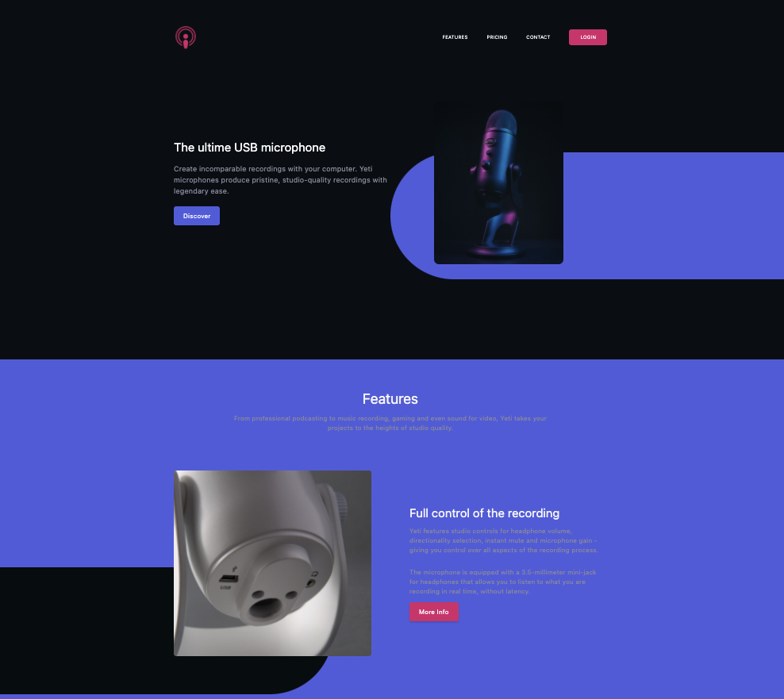

# :rocket: Landing Page

## Create a landing page for a product with Vue.js 

## Illustration
### 🖥   Desktop illustration


### 📱  Mobile illustration


## 🛠   Language/tools
- HTML5 / CSS3
- Vue3 
- Vite.js
- Tailwindcss
  

## 🎯   Goals
- Discover Vue.js version 3
- Discover Vite.js 
- Explore Tailwindcss
- UX / UI

## 🔗  How to use

### ⚙️   Launch the development server & meeting on http://localhost:3000/

### Project setup
```javascript
npm install
```

### Compiles for development
```javascript
npm run dev 
or 
npx vite
```

### Compiles and minifies for production
```javascript
npm run build
or 
npx vite build
```

## 🎟  Status 
Project not completed

## 🗓  Context 
Project developed as a junior web developer
